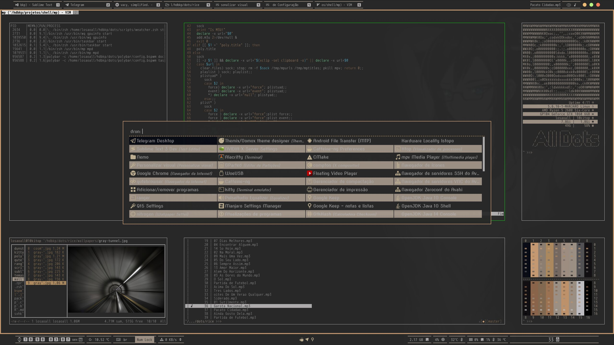

### [onedark](temas/themes/onedark_losaoall)

## Setup

distro|manjaro | plugins | configs
:--:|:-------:|:------:|:-----:
twm|[bspwm](https://github.com/baskerville/bspwm) | - | [bspwmrc](bspwmrc)
bar|[polybar](https://github.com/polybar/polybar) | [scripts](scripts) | [config](polybar/config.bspwm) , [modules](polybar/modules) , [taskbar](polybar/taskbar)
terminal|[kitty](https://github.com/kovidgoyal/kitty)| - | [kitty.conf](kitty/kitty.conf)
shell|[zsh](https://www.zsh.org/)| [zsh-autosuggestions](https://github.com/zsh-users/zsh-autosuggestions), [zsh-completions](https://github.com/zsh-users/zsh-completions), [zsh-history-substring-search](https://github.com/zsh-users/zsh-history-substring-search), [zsh-syntax-highlighting](https://github.com/zsh-users/zsh-syntax-highlighting) | [.zshrc](.zshrc)
editor|[sublime-text](http://www.sublimetext.com/3)| [gruvbox](https://github.com/Briles/gruvbox#readme), [MarkdownPreview](https://packagecontrol.io/packages/MarkdownPreview), [Livereload](https://packagecontrol.io/packages/LiveReload) | [files](sublime-text-3)
file-manager|[nemo](https://github.com/linuxmint/nemo)|[nemo-fileroller](https://github.com/linuxmint/nemo-extensions), [nemo-preview](https://github.com/linuxmint/nemo-extensions) | -
menu|[rofi](https://github.com/DaveDavenport/rofi)| - | [rofi.zsh](scripts/rofi.zsh)
player|[mpv](https://mpv.io/)| [mp](https://github.com/odilonscoelho/mp) | -
browsers|[qutebrowser](https://www.qutebrowser.org/)| [base16-qutebrowser](https://github.com/theova/base16-qutebrowser) | [config.py](qutebrowser/config.py)
gtk themes|[lxappearance](https://lxde.org/)| [themix-theme-oomox-git](https://github.com/themix-project/oomox-gtk-theme) | -
qt themes|[qt5ct](https://qt5ct.sourceforge.io/)| [qt5-styleplugins](https://github.com/qt/qtstyleplugins) | -
composer|[picom](https://github.com/yshui/picom)| - | [picom.conf](picom.conf)
sound|[pulseaudio](https://www.freedesktop.org/wiki/Software/PulseAudio/)| [pulseaudio-equalizer-ladspa](https://github.com/pulseaudio-equalizer-ladspa/equalizer), [pulsemixer](https://github.com/GeorgeFilipkin/pulsemixer) | -
network|[networkmanager](https://wiki.gnome.org/Projects/NetworkManager)| - | -
wallpapers|[nitrogen](http://projects.l3ib.org/nitrogen/)/[hsetroot](https://github.com/himdel/hsetroot)| - | -

### Dependências necessárias para completa aplicação dos dots.

* **zsh** - Não precisa ser seu shell padrão, mas é necessário para os scripts funcionarem.
* **[xorg-xrandr](https://xorg.freedesktop.org/)**
* **[xorg-xprop](https://xorg.freedesktop.org/)**
* **[wmctrl](http://tripie.sweb.cz/utils/wmctrl/)**
* **[xwinfo](https://github.com/baskerville/xwinfo)**
* **[translate-shell](https://www.soimort.org/translate-shell/)**
* **[mpv](https://mpv.io/)**
* **[xclip](https://github.com/astrand/xclip)**
* **[xorg-xclipboard](https://xorg.freedesktop.org/)**
* **[xdotool](http://www.semicomplete.com/projects/xdotool/)**
* **[yad](https://github.com/v1cont/yad)**
* **[themix-theme-oomox-git](https://github.com/themix-project/oomox-gtk-theme)**

#### Fonts
* **[nerd-fonts-arimo](https://github.com/ryanoasis/nerd-fonts)**
* **[nerd-fonts-mplus](https://github.com/ryanoasis/nerd-fonts)**
* **[iosevka](https://typeof.net/Iosevka/)**
* **[ttf-nova](http://openfontlibrary.org/font/nova)**

##### polybar

Módulos da polybar | Argumentos | Descrição | Dependências | scripts/files
:--:|:-------:|:------:|:-----:|:-----:
volume | N/H | Volume do Pulseaudio | [pulseaudio-equalizer-ladspa](https://github.com/pulseaudio-equalizer-ladspa/equalizer), [pulsemixer](https://github.com/GeorgeFilipkin/pulsemixer) | [modules](polybar/modules)
gpuinfo | wq gpuinfo start/stop | Módulos para placas Nvidia, funciona como daemon pode ser ativado/desativado clicando no módulo | N/H | [gpuinfo2.zsh](scripts/gpuinfo2.zsh), [modules](polybar/modules)
temperaturecpu | N/H | Temperatura geral | N/H | [modules](polybar/modules)
cpu | N/H | Uso da CPU | N/H | [modules](polybar/modules)
memory | N/H | Uso da RAM | N/H | [modules](polybar/modules)
eth | N/H | Uso da Rede Cabeada | N/H | [modules](polybar/modules)
xkeyboard | N/H | Layout keyboard | N/H | [modules](polybar/modules)
weatcher | wq weatcher start/stop | [OpenWeatcher](https://rapidapi.com/blog/lp/openweathermap/?utm_source=google&utm_medium=cpc&utm_campaign=Alpha_104783631314&utm_term=openweathermap_e&gclid=CjwKCAjwr7X4BRA4EiwAUXjbt4UTay9_M3MwRfr6G14RDl3mZq8iDEvJQn5zK5HH_JUNiE3x3xxtIxoC8XAQAvD_BwE) informações climáticas, funciona como daemon pode ser ativado/desativado clicando no módulo | [wget](https://www.gnu.org/software/wget/) | [weatcher.zsh](scripts/weatcher.zsh), [modules](polybar/modules)
calendar | N/H | | N/H | [bar.zsh](scripts/bar.zsh), [modules](polybar/modules)
