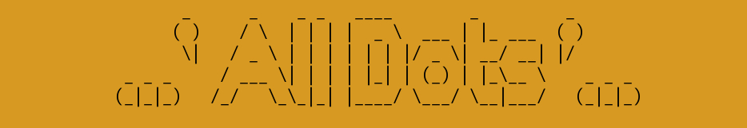
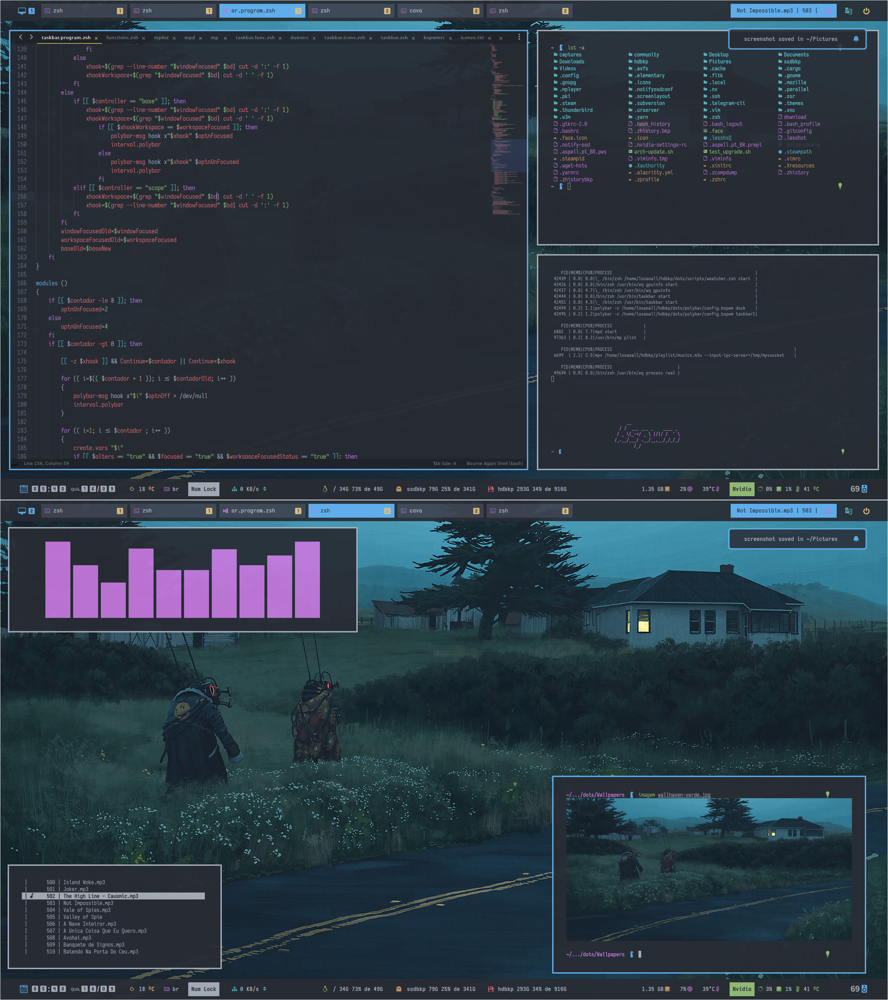

# welcome to the jungle !

### [Sandcastle-all-edition](temas/themes/sandcastle-all-edition)


## Setup

distro|manjaro | plugins | configs
:--:|:-------:|:------:|:-----:
twm|[bspwm](https://github.com/baskerville/bspwm) | - | [bspwmrc](bspwmrc)
bar|[polybar](https://github.com/polybar/polybar) | [scripts](scripts) | [config](polybar/config.bspwm) , [modules](polybar/modules) , [taskbar](polybar/taskbar)
terminal|[kitty](https://github.com/kovidgoyal/kitty)| - | [kitty.conf](kitty/kitty.conf)
shell|[zsh](https://www.zsh.org/)| [zsh-autosuggestions](https://github.com/zsh-users/zsh-autosuggestions), [zsh-completions](https://github.com/zsh-users/zsh-completions), [zsh-history-substring-search](https://github.com/zsh-users/zsh-history-substring-search), [zsh-syntax-highlighting](https://github.com/zsh-users/zsh-syntax-highlighting) | [.zshrc](.zshrc)
editor|[sublime-text](http://www.sublimetext.com/3)| [gruvbox](https://github.com/Briles/gruvbox#readme), [MarkdownPreview](https://packagecontrol.io/packages/MarkdownPreview), [Livereload](https://packagecontrol.io/packages/LiveReload) | [files](sublime-text-3)
file-manager|[nemo](https://github.com/linuxmint/nemo)|[nemo-fileroller](https://github.com/linuxmint/nemo-extensions), [nemo-preview](https://github.com/linuxmint/nemo-extensions) | -
menu|[rofi](https://github.com/DaveDavenport/rofi)| - | [rofi.zsh](scripts/rofi.zsh)
player|[mpv](https://mpv.io/)| [mp](https://github.com/odilonscoelho/mp) | -
browsers|[qutebrowser](https://www.qutebrowser.org/)| [base16-qutebrowser](https://github.com/theova/base16-qutebrowser) | [config.py](qutebrowser/config.py)
gtk themes|[lxappearance](https://lxde.org/)| [themix-theme-oomox-git](https://github.com/themix-project/oomox-gtk-theme) | -
qt themes|[qt5ct](https://qt5ct.sourceforge.io/)| [qt5-styleplugins](https://github.com/qt/qtstyleplugins) | -
composer|[picom](https://github.com/yshui/picom)| - | [picom.conf](picom.conf)
sound|[pulseaudio](https://www.freedesktop.org/wiki/Software/PulseAudio/)| [pulseaudio-equalizer-ladspa](https://github.com/pulseaudio-equalizer-ladspa/equalizer), [pulsemixer](https://github.com/GeorgeFilipkin/pulsemixer) | -
network|[networkmanager](https://wiki.gnome.org/Projects/NetworkManager)| - | -
wallpapers|[nitrogen](http://projects.l3ib.org/nitrogen/)/[hsetroot](https://github.com/himdel/hsetroot)| - | -

### Dependências necessárias para completa aplicação dos dots.

* **zsh** - Não precisa ser seu shell padrão, mas é necessário para os scripts funcionarem.
* **[xorg-xrandr](https://xorg.freedesktop.org/)**
* **[xorg-xprop](https://xorg.freedesktop.org/)**
* **[wmctrl](http://tripie.sweb.cz/utils/wmctrl/)**
* **[xwinfo](https://github.com/baskerville/xwinfo)**
* **[translate-shell](https://www.soimort.org/translate-shell/)**
* **[mpv](https://mpv.io/)**
* **[xclip](https://github.com/astrand/xclip)**
* **[xorg-xclipboard](https://xorg.freedesktop.org/)**
* **[xdotool](http://www.semicomplete.com/projects/xdotool/)**
* **[yad](https://github.com/v1cont/yad)**
* **[themix-theme-oomox-git](https://github.com/themix-project/oomox-gtk-theme)**

#### Fonts
Para completa aplicação dos dots, as seguintes fontes são necessárias:
* **[nerd-fonts-arimo](https://github.com/ryanoasis/nerd-fonts)**
* **[nerd-fonts-mplus](https://github.com/ryanoasis/nerd-fonts)**
* **[ttf-nova](http://openfontlibrary.org/font/nova)**

## How to this to work

<!-- The dots is composite the many smalls projects. propabily you don't need all, analyze of accord for your need.
 
* **[taskbar](https://github.com/odilonscoelho/taskbar)** - labels for polybar to the windows openeds
* **[mp](https://github.com/odilonscoelho/mp)** - daemon music player using mpv
* **gpuinfo** - informations about gpu nvidia - inluded in dots.
* **weatcher** - weatcher informations - included in dots.
* **wq** - driver necessary for corret execution to scripts the dots - included in dots. -->


##### Configuration
Os dots são compostos de varios scripts contidos na pasta "dots/scripts", você pode usar apenas algum script que o interesse ou conservar a estrutura dos diretórios e usar a automação proposta, os script são escritos em zsh, que não precisa ser o seu shell padrão, apenas uma dependência.

 Os scripts funcionam com variáveis de ambientes globais, tanto para colorir os itens da polybar como para aplicar temas aos terminais kitty e alacritty e ao script do rofi (não utilizo o rofi.conf ou rofi.rasi, mas você pode configurar o gerador de temas para usá-los), e que por consequência podem ser usadas a qualquer momento em qualquer script, similar ao que o pywal faz, uma diferença sginificativa é que o script que gera esse colorscheme e o aplica [theme.zsh](scripts/theme.zsh), realmente altera os arquivos de configurações dos programas dunstrc, xresources, rofi.rasi.

 Afim de evitar confusões com as várias alterações que precisam ser feitas nos scripts, eu utilizo o script wq como um programa direcionador para todos os scripts que compoẽm os dots, por exemplo no meu bspwmrc vai encontrar comandos como :
 ```
 wq gpuinfo start
 ```
 Aqui é usado um conceito bem interessante e ao meu ver bem funcional do shell script:

 o script chamado é o **wq** mas o script que realmente vai ser executado é o **gpuinfo.zsh** com o parâmetro **start**, que fornece o módulo polybar para placas nvidia.

 wq carrega a função disponível em gpuinfo.zsh e a executa, para todos os efeitos de rastreio do script o processo será o script wq, mas o codigo rodando será o do gpuinfo.zsh

 alguns programas que são usados e estão fora dos dots:

**[taskbar](https://github.com/odilonscoelho/taskbar)** - labels for polybar to the windows openeds

**[mp](https://github.com/odilonscoelho/mp)** - daemon music player using mpv


